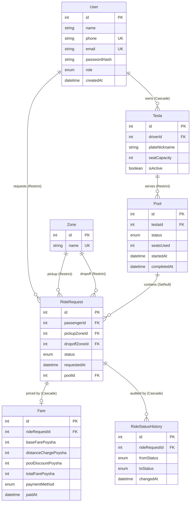

# Dhaka Tesla Pool

A ride-pooling demo for Dhaka. A few passengers heading into the same area at
the same time can share one Tesla and each pay less than they would alone —
while the driver (Jashim, behind the wheel of his Model 3 nicknamed **Bullet**)
earns one fare per rider.

## Summary & problem statement

Dhaka moves millions of people a day, but most point-to-point ride-hail trips
are sold as private rides: four seats, one fare, usually one passenger. Riding
solo is comfortable but wasteful — for the rider's wallet and for traffic.

This project is a small, honest version of the fix: **pooled rides**. When two
passengers need the same pickup area and their dropoffs are compatible — say
**Nusrat** wants **Banani → Mohakhali** and **Rafiq** needs **Banani →
Gulshan** — the system seats them in the same Tesla (Jashim's **Bullet**), runs
them as one pool, and prices every rider with the published rule:

> **Total = base fare (3000 poysha) + 1500 poysha per zone hop − 1000 poysha
> pool discount when the pool has more than one rider.**

Each of Nusrat's and Rafiq's one-hop trips therefore costs 3000 + 1500 − 1000 =
**3500 poysha (Tk 35.00)** instead of 4500 solo — the driver earns both fares,
the city leaves one more car at home.

## Features implemented (phase by phase)

**Phase 1 — Core ride-pooling backend (Express + Prisma)**
- User registration/login with roles `PASSENGER` and `DRIVER`; drivers register
  a Tesla (nickname + seat capacity); BCrypt-hashed passwords, JWT auth.
- Eight seeded Dhaka zones (Banani, Gulshan, Mohakhali, Dhanmondi, Mirpur,
  Uttara, Farmgate, Bashundhara) with a zone-adjacency graph for fare math.
- Ride requests with CASH / TESLAPAY; automatic pool matching on **same pickup
  + compatible dropoff** (zone groups), instant `MATCHED` on the first open
  pool or a new pool on the first idle active Tesla.
- Fare engine: base + per-hop distance charge − pool discount, recomputed for
  all riders whenever the pool membership changes; fares keyed per ride.
- Full pool lifecycle: `REQUESTED → MATCHED → DRIVER_ARRIVED → STARTED →
  COMPLETED` (or `CANCELLED`), with a step-transition guard and a full
  `RideStatusHistory` audit trail.
- Cancellation rules: cancel while `REQUESTED`/`MATCHED` only; solo cancel
  closes the pool, shared-pool cancel frees a seat and reprices survivors.
- Ownership enforcement everywhere: passengers see/cancel only their own rides;
  drivers only their own pools; role guards on every mutation.
- Concurrency safety: serializable transaction + row locks around pool matching
  guarantee a Tesla's seats are never overbooked (see *Concurrency handling*).

**Phase 2 — Passenger web app (Next.js App Router + BFF)**
- Login/register pages with inline validation; an httpOnly `JWT` cookie handled
  by a thin backend-for-frontend (BFF) proxy (`/api/*` → API), so the browser
  never holds the token.
- Ride listing (`/rides`), request flow (`/rides/new`: pickup/dropoff/payment),
  and a live ride detail view (`/rides/:id`) with a status stepper, Tesla card,
  fare breakdown, and cancellation — polling every few seconds until done.

**Phase 3 — Driver app + fixes**
- `/driver/dashboard`: sees their active pool (Tesla nickname, X/Y seats,
  passengers, fares) and advances it through completion with one button.
- Seats surfaced correctly via the Tesla's `seatCapacity`; settled fares on
  completion (CASH marked settled, TESLAPAY stamped `paidAt`).

**Phase 4 — Docker + tests hardening**
- Multi-stage Dockerfiles for the API and web app, `docker compose` (Postgres +
  API + web), idempotent startup migration/seed, `docs/docker.md`.
- Test coverage closed against the PRD's six required scenarios (see
  `CONTRIBUTING.md` → *Test Coverage*); 68 backend tests.

## Screenshots / GIFs

> Placeholder — I will fill these in manually.

## Architecture


The browser only talks to the Next.js app. Pages render in `src/app/`, and
browser fetches to `/api/*` are handled by a **BFF proxy**
(`src/app/api/[...path]/route.ts`) that forwards the request to the Node API and
reattaches the httpOnly auth cookie as a `Bearer` token — tokens never reach
the browser.

## Entity Relationship Diagram



(Source of truth: `backend/prisma/schema.prisma`; rendered version in
`docs/erd.md`.)

## Tech stack & justification

| Concern | Choice | Alternatives considered | Why | What would change my mind |
| --- | --- | --- | --- | --- |
| Backend | Express + TypeScript | Fastify, NestJS, Hono | Minimal, universally known, rich middleware ecosystem; TS everywhere for shared types. | The API grows into many modules needing DI/structured architecture → NestJS. |
| ORM | Prisma | Drizzle, TypeORM, raw SQL | Schema-first Migrations + generated types client; correct `SERIALIZABLE` transactions for the last-seat race. | Needing to hand-tune complex SQL (e.g. heavy analytics) beyond what the query builder does well. |
| Auth | JWT (jsonwebtoken) + httpOnly cookie via BFF | Opaque session, NextAuth, Lucia | Stateless, works across API and web; token kept server-side in the browser. | Needing server-side revocation/refresh-token rotation at scale → switch to sessions or short-lived tokens + refresh. |
| Frontend | Next.js App Router (React 19) + Tailwind CSS v4 | Vite SPA, Remix, plain SSR | BFF proxy in the same app, file-based routes/page-level code splitting; easy server/client split. | Becoming a native-mobile-first product → keep API, replace/ignore web BFF layer for RN clients. |
| Testing | Jest + Supertest + ts-jest (integration against a real test Postgres) | Vitest, Playwright e2e | Integration tests against real DB/HTTP prove the flows the user cares about. | Needing browser-level regression coverage → add Playwright e2e. |
| Hosting | Not deployed yet (PRD Phase: next step) | Vercel, Railway, Render, Fly | App is fully Dockerized (api + web + db via `docker compose`) so it targets any container host. | Deployment requirements (managed Postgres, CI, env) → pick the host, wire CD. |

## Project structure (brief)

```
backend/
  prisma/            # schema.prisma, migrations/, idempotent seed.ts
  src/
    app.ts           # Express app: CORS allowlist, JSON, routers, error handling
    server.ts        # entrypoint (reads PORT)
    config/          # env config, zone graph, compatible-zone groups, transitions
    controllers/     # thin HTTP handlers
    services/        # business logic: auth, rides, pools(matching), fares, drivers
    routes/          # REST route tables
    middlewares/     # requireAuth / requireRole / validate / error / notFound
    utils/           # zod schemas, jwt, asyncHandler, logger, prisma client
  tests/             # Jest + Supertest suites (isolated test DB)
frontend/
  src/app/           # pages (/, /login, /register, /rides, /rides/new, /rides/[id], /driver/dashboard)
  src/app/api/       # BFF: auth handlers + [...path] proxy to the Node API
  src/components/    # Button, forms, RideCard, RideDetail, DriverDashboard, Toasts…
  src/lib/           # config, apiClient, shared types, formatting
docs/                # architecture.md, erd.md, matching-rule.md, docker.md
```

## Prerequisites

- **Node.js ≥ 20.9** (developed on Node 26) and npm ≥ 10. Next.js 16 needs
  Node 20.9+.
- **PostgreSQL ≥ 15** for local (non-Docker) runs, with `psql` on `PATH` (the
  test setup script creates the test database).
- **Docker Desktop / Docker Engine + Compose v2** for the one-command setup.

## Environment variables

All variables are defined in committed **example** files with placeholder,
non-secret values — there are no real secrets in the repository:

| File | Contents |
| --- | --- |
| `backend/.env.example` | `DATABASE_URL`, `TEST_DATABASE_URL`, `JWT_SECRET`, `JWT_EXPIRES_IN`, `PORT`, `CORS_ORIGINS` |
| `frontend/.env.example` | `NEXT_PUBLIC_API_URL` (web → API base URL) |
| `.env.example` (root) | Compose values: `POSTGRES_*`, `DATABASE_URL`, `JWT_*`, `PORT`, `NEXT_PUBLIC_API_URL`, `WEB_PORT` |

Typical dev values (see the example files): `DATABASE_URL` for
`localhost:5432/dhaka_tesla_pool`, `TEST_DATABASE_URL` for
`dhaka_tesla_pool_test`, `NEXT_PUBLIC_API_URL=http://localhost:4000`.

## Local setup (without Docker)

```bash
# backend
cd backend
cp .env.example .env            # then set DATABASE_URL / JWT_SECRET for real
npm install
npm run db:migrate              # prisma migrate dev
npm run db:seed                 # idempotent: zones + Jashim/Nusrat/Rafiq/Shirin
npm run dev                     # API on http://localhost:4000

# frontend (new terminal)
cd frontend
cp .env.example .env.local
npm install
npm run dev                     # web on http://localhost:3000
```

Open http://localhost:3000 (if port 3000 is taken, run on 3001 and set
`NEXT_PUBLIC_API_URL` accordingly).

## Docker (one-command setup)

```bash
cp .env.example .env            # compose reads this automatically
docker compose up --build       # db + api + web
open http://localhost:3000
```

- `api` runs `prisma migrate deploy` then the idempotent seed on every start.
- The web container is published on `WEB_PORT` (default 3000); the API is
  internal (`http://api:4000`) and only reachable through the BFF.
- Reset everything: `docker compose down -v && docker compose up --build`.

See `docs/docker.md` for the full guide.

## Migration / seed instructions

```bash
cd backend
npm run db:migrate              # create/apply migrations during development
# or, non-interactively against an existing DB:
npx prisma migrate deploy

npm run db:seed                 # prisma db seed (tsx prisma/seed.ts)
```

The seed is **idempotent** — safe to run at every container start. It upserts
the 8 Dhaka zones and creates the four demo accounts only if missing, and only
attaches a Tesla to a driver who doesn't have one yet.

## Running frontend / backend / tests

```bash
# backend tests (creates the test DB, migrates, truncates, runs 68 tests)
cd backend && npm test

# backend checks
cd backend && npm run typecheck && npm run lint && npm run format:check

# frontend checks
cd frontend && npm run lint && npm run build

# services (dev)
cd backend && npm run dev       # API on :4000
cd frontend && npm run dev      # web on :3000
```

## Demo credentials

All seeded accounts share the password `password123` (a fixed demo password —
the project has no email delivery):

| Name | Role | Tesla | Email | Phone |
| --- | --- | --- | --- | --- |
| Jashim | Driver | Bullet (4 seats) | jashim@example.com | 01730000001 |
| Nusrat | Passenger | — | nusrat@example.com | 01730000002 |
| Rafiq | Passenger | — | rafiq@example.com | 01730000003 |
| Shirin | Passenger | — | shirin@example.com | 01730000004 |

Recommended demo: log in as **Jashim** (driver dashboard), then in another
window as **Nusrat** and request **Banani → Mohakhali** (TESLAPAY) — it matches
into Bullet's pool immediately; from the driver dashboard, advance the pool
(Mark arrived → Start ride → Complete ride) and watch the fare settle.

## Deployment URL

**Not yet deployed.** Deployment is the next step (Dockerized images are ready;
see *Next improvements*).

## API overview

All web traffic goes through the BFF at the same paths (`/api/...` on the web
origin); the backend also exposes them directly on `:4000`.

| Method | Endpoint | Auth | Description |
| --- | --- | --- | --- |
| `POST` | `/api/auth/register` | — | Register passenger or driver (+ optional Tesla) |
| `POST` | `/api/auth/login` | — | Login by email or phone → `{ token, user }` |
| `GET` | `/api/users/me` | Bearer | Current user profile |
| `GET` | `/api/zones` | — | Seeded Dhaka zones, ordered by name |
| `POST` | `/api/rides` | Passenger | Create a ride → immediate match / new pool |
| `GET` | `/api/rides` | Any | Logged-in user's own rides (newest first) |
| `GET` | `/api/rides/:id` | Owner / serving driver | Ride detail with pool, tesla, fare, history |
| `PATCH` | `/api/rides/:id/cancel` | Passenger owner | Cancel while REQUESTED/MATCHED |
| `GET` | `/api/driver/pools/active` | Driver | Driver's own active pools with passengers + fares |
| `PATCH` | `/api/driver/pools/:id/advance` | Driver owner | Advance the pool one step (or to a target status) |
| `GET` | `/health` `/api/health` | — | Liveness probe |

Error shape: `{ "error": "...", "issues": [...] }` with appropriate 4xx/5xx.

## Key decisions & trade-offs

- **Money as integer poysha** (1 Taka = 100 poysha). No float rounding; fares
  are exact integers all the way to the DB. Trade-off: every UI render converts
  to "Tk x.xx".
- **SERIALIZABLE transaction + row locks for pool matching.** Two requests can't
  both grab the last seat (see *Concurrency handling*). Trade-off: heavier than
  read-committed; mitigated with a small retry/backoff for conflict errors.
- **BFF proxy with an httpOnly cookie.** The browser stores no JWT; login claims
  a cookie the proxy turns into `Authorization: Bearer`. Trade-off: one extra
  hop; mitigated by co-locating the BFF with the frontend.
- **Zone-group matching rule.** Pools require the same pickup and compatible
  dropoffs (identical or same group: North / Central-North / Central-West), Keeps
  the demo's routes sensible and the fare math explainable. Trade-off: coarser
  than true geospatial matching (no real maps yet).
- **Idempotent seed with a fixed demo cast.** Re-running seed at every container
  start is safe and demoable. Trade-off: fixed demo passwords; fine for a demo,
  wrong for production.

## Known limitations

- **No real geolocation/route mapping** — zones are a fixed 8-node graph; the
  distance charge uses BFS hop count, not actual distance or traffic.
- **No real payment gateway** — TESLAPAY just stamps `paidAt` on completion;
  CASH is marked settled only.
- **Polling, not pushing** — the ride-detail page polls every few seconds
  instead of using WebSockets/SSE.
- **One pool per Tesla, first idle active Tesla wins** — no fleet-wide route
  optimization or batching across drivers yet.
- **Shared demo passwords and no email/SMS delivery** — registration is
  password-only and OTP/verification is out of scope.
- **CORS allowlist defaults to local ports** — must be extended (`CORS_ORIGINS`)
  before pointing a real domain at the API directly (the BFF path is unaffected).
- **No admin tooling** — drivers can't set availability in the UI (the `isActive`
  flag exists in the model), there's no operator dashboard, rate limiting, or
  refresh-token rotation.

## Next improvements

- Deploy: containerize to a cloud host (Railway/Render/Fly) with a managed
  Postgres; point `NEXT_PUBLIC_API_URL` and `CORS_ORIGINS` at real domains; wire
  a CI pipeline.
- Live ride updates via WebSocket/SSE instead of polling.
- Real maps + geocoding for pickup/dropoff and ETA.
- Payment integration (bKash, Nagad, SSLCommerz or card) replacing the stub.
- Driver availability toggle in the UI; fleet analytics.
- Admin dashboard; rate limiting; refresh tokens; e2e browser tests (Playwright).

## AI usage

See below.

## Concurrency handling (PRD §14)

**The problem — the last-seat race.** Bullet has 4 seats. One seat is already
taken, and three passengers submit compatible ride requests at nearly the same
instant. Without care, all three requests could read `seatsUsed = 1`, each
conclude "there's room", and the pool would end at `seatsUsed = 4` with four
riders seated — one too many.

**The fix.** Pool matching (`findOrCreatePoolForRide` in
`backend/src/services/poolService.ts`) runs inside a single
`SERIALIZABLE` transaction that:

1. locks every open pool and every active Tesla with
   `SELECT ... FOR UPDATE` (so concurrent transactions can't both see the same
   stale count),
2. re-checks capacity against the locked, current `seatsUsed`,
3. joins the rider or (if full/incompatible) starts a new pool on the first
   idle active Tesla,
4. on a serialization conflict (`P2033`/`P2034`/deadlock), retries with a short
   linear backoff instead of failing outright.

A Postgres trigger (`pool_seats_used_within_capacity`) enforces
`0 <= seatsUsed <= seatCapacity` as a final backstop.

**Proven by a test.** `rides.test.ts` → *"never overbooks a seat under
concurrent last-seat demand"* fires six `POST /api/rides` in parallel via
`Promise.all` on Bullet's 4-seat capacity, then asserts the exact accept/reject
split and — for every open pool — `seatsUsed <= seatCapacity`, with every
matched ride accounted for inside a matched pool.

## Demo video

> Placeholder — link coming soon.