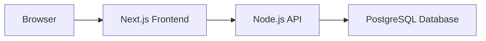

# Architecture

The **browser** renders the user interface and makes HTTP requests to the frontend.

The **Next.js Frontend** (App Router) serves the UI and proxies API calls to the backend.

The **Node.js API** (Express + TypeScript) exposes REST endpoints and enforces business logic.

The **PostgreSQL Database** persists application data, accessed via the Prisma ORM.