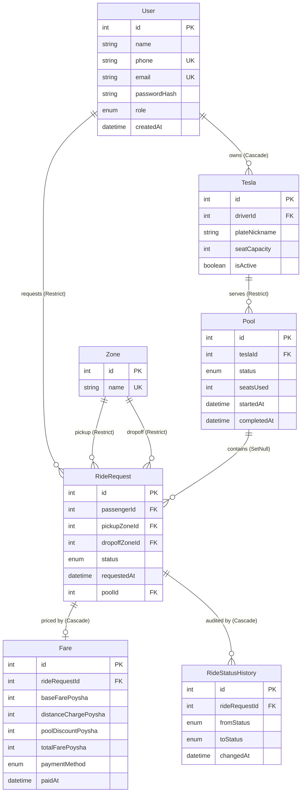

# Entity Relationship Diagram

Mirrors `backend/prisma/schema.prisma`. All money fields are integer poysha (1 Taka = 100 Poysha). `RideRequest.status` and `Pool.status` share the same `RideStatus` lifecycle enum.

