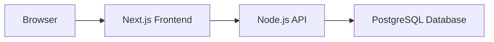

# Entity Relationship Diagram

The **browser** is the user's entry point into the application.

The **Next.js Frontend** handles rendering and user interaction.

The **Node.js API** owns the data access layer and serves the frontend.

The **PostgreSQL Database** is the single source of truth for all persisted data.