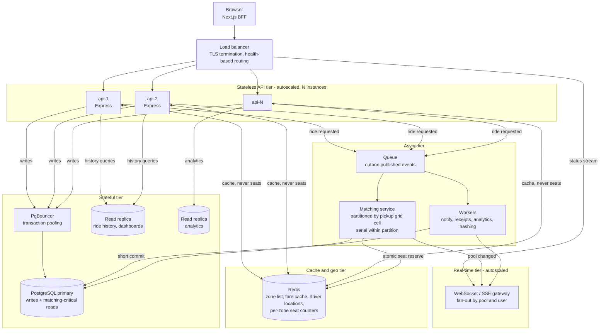

# Scaling to Dhaka: Design Reasoning for 1M Passengers / 100K Drivers

> **This is a design exercise, not implemented code.** Everything below is
> reasoning about a hypothetical future in which this MVP serves ~1,000,000
> passengers and ~100,000 drivers in Dhaka. None of it is built, none of it is
> planned as part of the current scope, and no code in this repository reflects
> it. The current MVP **intentionally** omits all of it: at its present scale
> every item here would be premature complexity that costs money in
> infrastructure, operational burden, and correctness risk while buying nothing.
> This document exists to record *why* each piece would eventually be needed and
> what it would cost in tradeoffs, so the decision is informed later rather than
> improvised under load.

The architecture being reasoned about is the one actually in this repository:

| Layer | Current implementation |
| --- | --- |
| Frontend | Next.js App Router acting as a BFF — `frontend/src/app/api/[...path]/route.ts` proxies every call to the API and holds the JWT in an httpOnly cookie |
| API | Express + TypeScript, JWT auth (`backend/src/utils/jwt.ts`), Zod validation |
| ORM / DB | Prisma 6 → PostgreSQL 16, one `PrismaClient` (`backend/src/utils/prisma.ts`) |
| Matching | Synchronous `SERIALIZABLE` transaction with `FOR UPDATE` row locks (`backend/src/services/poolService.ts:134`) |
| Geo | 8 fixed zones, 3 hand-made compatibility groups, a 28-entry static distance table |
| Updates | Client-side polling every 4 s (`frontend/src/components/RideDetail.tsx:13`) |
| Logging | `console.info` status lines + a `RideStatusHistory` audit table |
| Deploy | Docker Compose: `db` + `api` + `web` |

Arithmetic below is deliberately rounded order-of-magnitude estimation, not
benchmarking. It exists to show *direction and shape*, not precise capacity
numbers.

---

## 1. Horizontal scaling of the API

The API is already close to horizontally scalable: it holds no server-side
session state, and JWT verification is a local signature check
(`backend/src/utils/jwt.ts:16`), so any instance can serve any request behind a
load balancer with no sticky sessions. The container is stateless and
health-checked already (`/health`, wired in `docker-compose.yml`), which is
exactly what an autoscaler needs, so scaling out is mostly an orchestrator
change — run N instances behind an L4/L7 balancer with round-robin routing and
scale on CPU and p95 latency rather than on request count.

The catch is that auth is only *half* stateless. `requireAuth` calls
`findById(payload.userId)` on **every** authenticated request
(`backend/src/middlewares/auth.ts:31`), so the database is hit once per
authenticated call purely to re-read a user the token already identifies; the
statelessness that makes horizontal scaling easy is thrown away on the hottest
path. The fix is to trust the token's claims for authorization (carry `role` and
a token version in the payload) and revalidate lazily — a Redis denylist checked
only on sensitive operations, or a periodic refresh — so that scaling out stops
meaning "multiply the load on Postgres by N".

Logout is the other half of the same story: `POST /api/auth/logout` only
expires the browser cookie (`frontend/src/app/api/auth/logout/route.ts`), and
since a JWT is self-contained there is no server-side revocation, so a stolen
token stays valid for its full 7-day lifetime. At 1M users the exposure is real
and a Redis-backed `jti` denylist (or a `tokenVersion` claim checked against a
cached value) becomes the minimum bar.

## 2. Database scaling

### Read replicas

Ride history, driver dashboards, and analytics are read-heavy, append-mostly,
and never participate in a correctness decision — today they compete for the
same primary and pool that seat accounting depends on. Streaming replication to
one or two read replicas and pointing those queries at `?replica` datasources
takes the dashboards off the critical path entirely, so a driver refreshing a
history list during rush hour never competes with a passenger's match.

The caveat is read-after-write: a passenger who just posted a ride and lands on
the detail page must be served by the primary, or replication lag will show them
a ride that does not exist yet. The standard handling is to route by intent
(writes and anything immediately following a write go to the primary; history
and analytics go to replicas) rather than trying to build a lag-aware router.

### Connection pooling

PostgreSQL defaults to `max_connections = 100`, and Prisma opens a pool per API
instance sized to CPU count. Ten instances is already past the ceiling, and the
polling load in §3 makes it worse long before the database runs out of CPU —
each poll holds a pooled connection for the length of its query. Fronting the
primary with **PgBouncer in transaction-pooling mode** decouples the number of
client connections from the number of server connections, which is what allows
the API tier to autoscale freely.

Transaction mode is compatible with the current `SERIALIZABLE` transactions,
because nothing depends on session-level state — but it is worth stating the
constraint explicitly: `pg_advisory_xact_lock` is fine, session-scoped
`pg_advisory_lock` and `SET`-based tuning are not, so any change in §2.3 has to
respect that boundary. Connection pool exhaustion is also the single most
common way a horizontally-scaled Node + Postgres system falls over, and at that
point the symptom (timeouts) looks nothing like its cause (pool config), which
is why it belongs in §7's metrics rather than only in a runbook.

### Why the current matching becomes a bottleneck

The current design is correct and elegant: one transaction re-reads and locks
candidates, verifies capacity after acquiring the locks, and commits — and the
`pool_seats_used_within_capacity` trigger is a final backstop. It is also
**O(contended resources) per request**, which is exactly what breaks at scale.
Every ride request locks *all* open pools with `FOR UPDATE`
(`backend/src/services/poolService.ts:218`) before it may even choose one, and
when no compatible pool is found it locks *all* active Teslas
(`backend/src/services/poolService.ts:274`) — at 100,000 drivers that is up to
100,000 row locks for one new ride.

Three amplifiers stack on top. The lock set grows with the fleet, so lock
acquisition — and the transaction's hold time — grows with it. `SERIALIZABLE`
adds predicate locks on top of the explicit ones, so overlapping transactions
conflict before they even reach the `FOR UPDATE`. And the fare recompute runs
*inside* the same transaction (`backend/src/services/poolService.ts:338`), so
the exclusive section includes writes to every member's `Fare` row, not just a
seat counter. `withSerializableRetry` then retries up to 5 times with linear
backoff (`backend/src/services/poolService.ts:15`), and every retry re-does the
entire lock sweep — so under contention, latency and CPU amplify superlinearly.
Throughput on a contended resource is roughly `1 / critical-section duration`,
which means matching latency degrades as the fleet grows; a passenger waiting
seconds for a match is a product failure, not merely a scaling one.

### Proposed alternative, and the tradeoff

**Cheapest real win, no new infrastructure:** replace the global lock sweep with
a per-zone advisory lock — `pg_advisory_xact_lock(hash(pickupZoneId))` — so the
lock set becomes O(1) per zone instead of O(all open pools). Correctness stays
entirely inside Postgres, the existing concurrency tests remain the proof, and
the change is a few lines. This is the step to take first, because it converts
the failure mode without introducing anything to operate.

**The full answer: a dedicated matching service.** The ride request is written
to Postgres as `REQUESTED` with no locks, and a match event is published to a
queue partitioned by pickup zone (or, in §5, by grid cell). A matching worker
per partition processes its partition serially, so "only one matcher per zone at
a time" becomes a structural property of the topology rather than something
enforced by locks; per-pool seat counts live in Redis and reservation is a
single atomic Lua script, with the worker committing the assignment in a short
transaction touching one pool and one ride. The database keeps the last line of
defence, so correctness is enforced where it is provable.

The tradeoff is real and deserves to be stated plainly. The MVP's approach is
~150 lines in one function, needs no extra infrastructure, and has a test suite
that proves no seat is ever overbooked under concurrent last-seat demand. The
service version replaces that with a distributed-systems correctness argument:
atomic Lua, idempotent consumers, retry/dead-letter handling, and a
reconciliation job for the window where a worker commits an assignment and dies
before acking. It also makes matching *eventually* consistent — the ride is
briefly unmatched while the event round-trips — so the UX gains a "finding your
ride" state it does not have today, and Redis stops being a disposable cache and
becomes a correctness-bearing dependency, which is an entirely new outage class
(`redis_loss = lost_pool_state`) the MVP simply does not have. Take that trade
only when per-zone advisory locks have demonstrably stopped being enough.

## 3. Real-time updates

The 4-second poll in `frontend/src/components/RideDetail.tsx:13` is a
reasonable MVP choice, but its cost is linear in *open pages*, not in user
actions. Taking a deliberately conservative 1% of 1.1M users with a ride detail
page open during rush hour gives ~11,000 concurrent pollers, or ~2,750 requests
per second of pure polling overhead — before a single new ride is requested, and
regardless of how many API instances you run, since every poll consumes a pooled
database connection (§2.2). On top of that, a 4-second floor is a poor product
experience for the one moment that matters most: the driver arriving.

WebSockets (or Server-Sent Events, which fit this use case better — the traffic
is one-directional server→client and SSE reconnects natively) let the API push a
status transition the moment it is committed, turning per-rider polling into
per-transition delivery. The volume then tracks real ride activity — on the order
of a few million transitions a day — instead of the open-page count, which is
the entire point. The hard part is not the socket, it is the **fan-out**: a
driver on a pool needs events for every member of that pool, and at 1M users a
naive in-process broadcast does not work because the API instance holding the
connection is rarely the instance that committed the change, so the realtime tier
becomes its own horizontally-scaled service subscribing to Redis pub/sub or the
event queue (§6) and keyed by pool and user.

Keep polling as the fallback path regardless — it is what makes a dropped socket
degrade into slightly-stale data rather than a dead screen, and it is also the
recovery path when a client reconnects after the mobile network hands off
between Dhaka towers.

## 4. Caching

**Safe to cache, and high value:** the zone list is small reference data that
changes only on an admin action, so a long TTL with tag-based invalidation is
close to free. Fare estimates are the biggest read-volume win — `computeFare` is
a pure function of (pickup, dropoff, pooled, seats), so the per-seat base and
distance components cache cleanly by zone pair with negligible invalidation.
Active driver locations are the clearest case: high write rate, 30–60 s TTL, and
value only for the *next* match, which makes Redis the natural primary read
path with asynchronous write-behind to Postgres.

**Must never be cached:** `Pool.seatsUsed` and anything derived from it, because
that value *is* the no-overbooking invariant — the `SERIALIZABLE` transaction and
the DB trigger exist precisely to guarantee a join decision is made against
locked, current data, and a cached read used to accept a rider would reintroduce
exactly the overbooking bug the test suite guards. `RideRequest.status` must
never be cached either, since freshness is the entire purpose of §3 and a cached
status is the staleness that polling was invented to avoid. The same reasoning
rules out caching a pooled fare *total*: the pool discount flips the moment a
second member joins, which is why `recomputePoolFares` exists, so only the
per-seat components are cacheable, never the discounted sum.

## 5. Geospatial matching

The 8 fixed zones with 3 hand-made compatibility groups
(`backend/src/config/matching.ts`) and a 28-entry static distance table
(`backend/src/config/zoneDistance.ts`) are a deliberate MVP abstraction: they
make matching deterministic, unit-testable, and free of external dependencies,
at the cost of being coarse — a rider in Bashundhara and one in Mirpur are
7 km apart but land in different groups. Real matching would store driver and
pickup positions as PostGIS `geography(Point, 4326)` with a GiST index and select
candidates with `ST_DWithin(drv.location, pickup, 3000)`, turning "which zones
are compatible" into "which drivers are nearby and heading my way".

The hard part is *not* distance, it is compatibility. The zone groups encode a
route-level judgement — two dropoffs are compatible if the trips share
overlapping corridors, not if they are close — so a real implementation needs
route geometry (OSRM or Mapbox) compared for shared waypoint fraction, or a
cheaper approximation: same origin cell plus destination cells on a shared
corridor. The grid cell from that indexing is also the natural partition key for
the matching service's queue (§2.3), which is a good reason to adopt geohash or
H3 cells rather than raw lat/lon; Redis GEO is an alternative when the matching
hot path should not touch Postgres at all.

The tradeoff is real: this trades a deterministic, dependency-free, testable
table for an external routing provider with per-call cost, latency, and
occasional unavailability. The mitigation is to cache computed routes, fall back
to great-circle distance when the provider is down, and to keep the estimator
behind an interface so the current table remains a valid test double.

## 6. Async processing

Several things belong off the request path. Notifications (WhatsApp/SMS/push for
match, driver-arrival, and cancellation — WhatsApp being the channel Dhaka users
actually live on) are network-bound, retry-prone, and must never be able to fail
a ride. Receipt/PDF generation is CPU- and I/O-heavy with no latency
sensitivity. Analytics rollups over ride history should not run against the
primary at all.

The queue choice follows from §4: **BullMQ** reuses the Redis already introduced
and keeps one stack to operate, while **SQS** gives durability and a managed
dead-letter queue for less ops work but adds a second messaging system. The
engineering rule that matters more than the choice: publish events through a
**transactional outbox** rather than writing to the broker inline, because a
committed pool assignment whose notification event was lost to a broker blip
leaves the system permanently inconsistent in a way no retry loop can repair.

One item is easy to miss and worth calling out: `logStatusTransition` writes an
extra `RideStatusHistory` row *inside* the matching transaction
(`backend/src/utils/logger.ts:25`), so every audit write currently lengthens the
critical section discussed in §2.3 — that belongs on the queue, and the pool
transaction should be reserved for state changes only. Separately, password
hashing is `bcrypt` at cost 10 (`backend/src/services/authService.ts:9`), roughly
100 ms of blocking CPU per registration; at 1M users that is enough to saturate
a Node event loop during a signup burst, so it moves to a worker thread or a
capped-concurrency pool rather than being left on the request path.

## 7. Observability

Today's `console.info` line in `backend/src/utils/logger.ts:21` has no
correlation ID, no request context, and no aggregation story — it is legible for
one developer watching one terminal, and useless across twelve instances. At
this scale the minimum viable stack is structured JSON logging (pino) with a
request ID propagated across the Next.js BFF hop — which is currently invisible,
since the BFF proxy adds no trace context — plus Prometheus metrics and
OpenTelemetry traces covering BFF → API → database.

The metrics that matter are not the generic RED trio alone. The ones that would
have caught the §2.3 problem early are domain-specific: match latency p50/p95/p99,
**serialization-retry rate**, 409 "Seat no longer available" rate, pool fill
factor, and connection-pool saturation. The retry counter deserves emphasis —
`withSerializableRetry` currently swallows and retries serialization failures
silently, so the single most important early-warning signal for the exact failure
mode described in §2.3 is presently invisible; surfacing it as a metric and
alerting on its rate is what turns this document's prediction into a measured,
debatable number. Add error tracking (Sentry) grouped by release, and note that
log *volume* is not the constraint — a few million status lines a day is trivial
— so the requirement is structure and correlation, not capacity.

## 8. Scaled Architecture

Read the diagram against the sections above: the load balancer in front of N
stateless API instances is §1; the primary/replica split and PgBouncer are §2;
the matching service and its queue are the §2.3 alternative; Redis is the §4
cache (with the "never seats" annotation marking the §2.3 hot path, where seat
state is owned by the matching worker rather than read from cache); and the
WebSocket tier is §3, fed by the queue rather than by the API instance that
happened to handle the request.

---

## Suggested order of adoption

Sequenced by ratio of capacity gained to risk introduced, not by importance:

1. **Per-zone advisory locks** (§2.3) — largest win, stays in Postgres, existing
   tests still prove it.
2. **Structured logging + the serialization-retry metric** (§7) — before any of
   the rest, so the next steps are measured rather than assumed.
3. **PgBouncer** (§2.2) — unblocks autoscaling.
4. **Read replicas** (§2.2) — after connection pressure is under control.
5. **Redis for reference data, fares, and driver locations** (§4).
6. **SSE/WebSocket realtime tier** (§3) — the largest product-visible win, and
   the one that most reduces baseline load.
7. **Outbox + queue + background workers** (§6).
8. **Dedicated matching service** (§2.3) — only with data showing advisory locks
   are no longer sufficient.
9. **Geospatial matching** (§5) — last; it is a product change (a new matching
   rule and a new fare model), not a scaling change, and it should be driven by
   demand for precision rather than by load.
